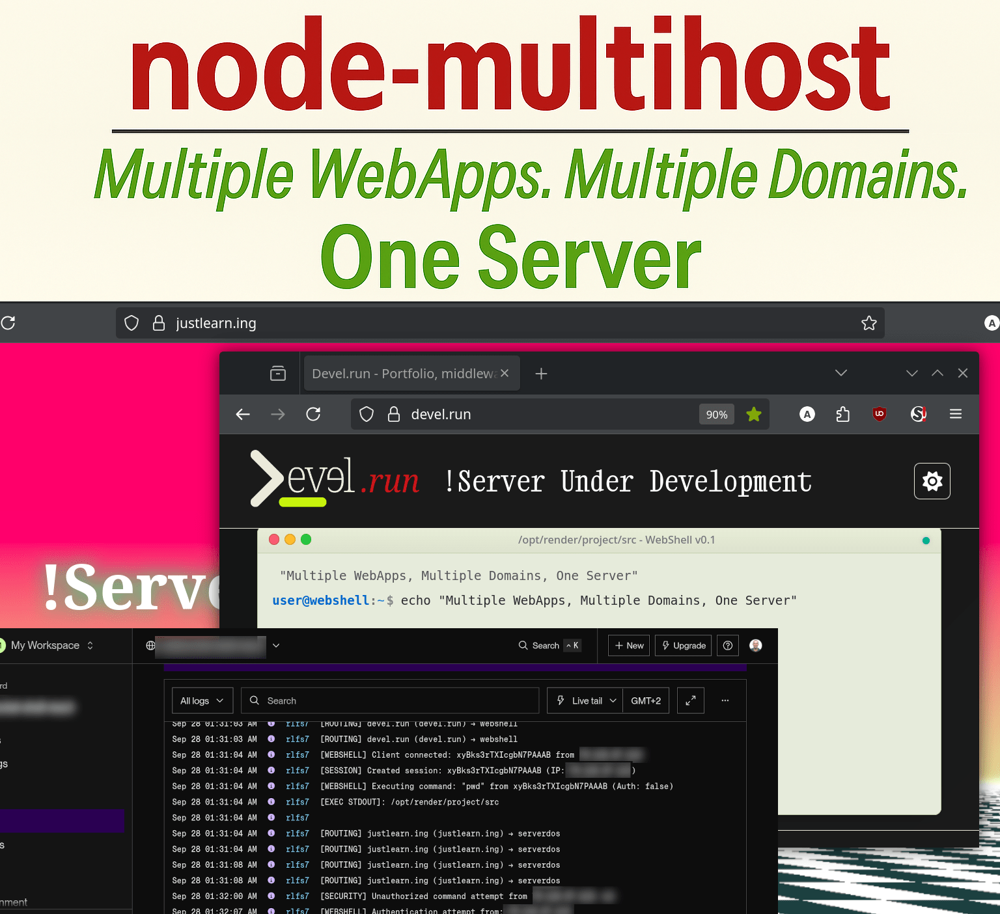
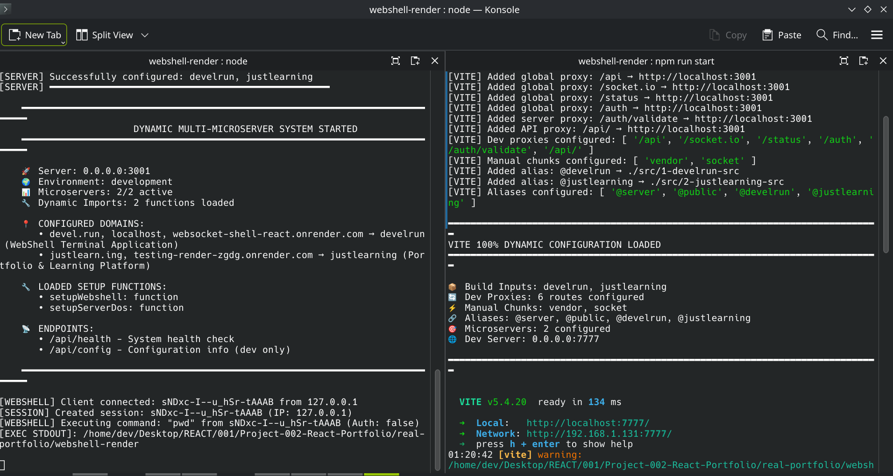
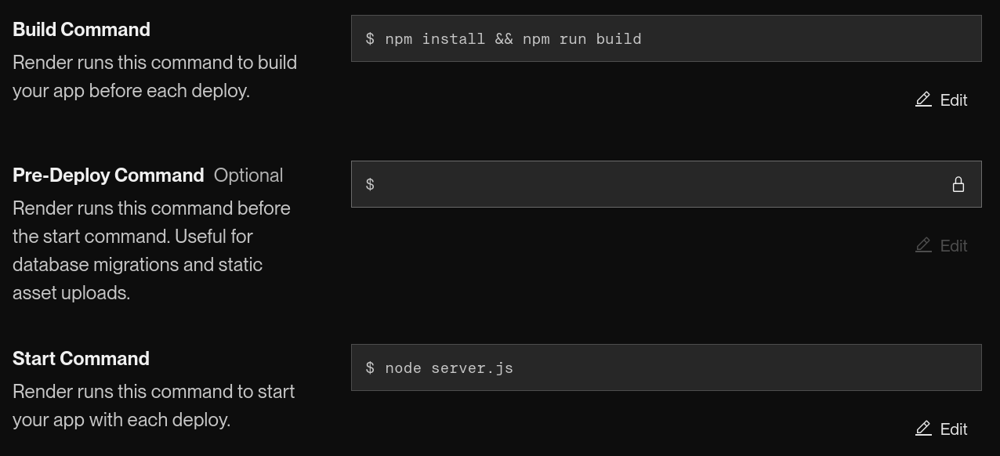

# # node-multihost

## Multi-Server Routing Framework

---

Milk every drop of the very limited free-tier accounts on services like Render.com



A Dev/Prod. framework that enables hosting multiple independent web applications (microservers) within a single.

Each microserver maintains its own frontend, backend logic, and assets whilst sharing common infrastructure.

Domain-based routing automatically directs requests to the appropriate microserver.

What you develop is exactly what you get. You can optimize server costs by **pushint to the limits the very limited free-tier options on platforms like Render.com**, ...or simply, maintain an organized structure of multiple services where necessary.

---

## Implementation

This repository includes a working example with two microservers which I use for my websites.

### 1. WebShell Terminal (devel.run)

- **Domains:** `devel.run`, `localhost` (*Further explanation about localhost will be explained)
- **Purpose:** Browser-based terminal interface
- **Features:** Socket.IO, API auth

### 2. Portfolio Platform (justlearn.ing)

- **Domains:** `justlearn.ing`
- **Purpose:** Notes from courses I've been engaged
- **Features:** Portfolio, Blog, etc. 

---

## Directory Structure

The framework uses isolated directories for each microserver:

```
project/
├── 📌servers.config.json      # Contains all servers info needed
├── 📌server.js                # Main server entry point
├── vite.config.js             # Dynamic Vite config
│
├── server/                      # BACKEND
│   ├── 📌server-routing.js        # Domain-based routing logic
│   │
│   ├── 1-develrun-server/         # Server 1 backend
│   │
│   └── 2-justlearning-server/      # Server 2 backend
│   
│
├── src/                        # FRONTEND
│   ├── 1-develrun-src/           # WebShell frontend
│   │   ├── App-Develrun.jsx
│   │   ├── main.jsx
│   │   └── Its own components/hooks/styles/slices .....
│   │ 
│   └── 2-justlearning-src/       # Portfolio frontend
│       ├── App-Justlearning.jsx
│       ├── main.jsx
│       └── Its own components/hooks/styles/slices ..... 
│  
│  
└── public/                     # PUBLIC ASSETS (html, img's, etc.)
    ├── 1-develrun-public/        # SERVER 1 PUBLIC
    │   ├── index-webshell.html
    │   ├── logo-light.png
    │   └── logo-dark.png
    │   
    └── 2-justlearning-public/    # SERVER 2 PUBLIC
        └── index-serverdos.html
```

## Adding New Microservers

New microservers are loaded dynamically based on configuration.

1. **Update Configuration:** Add entry to `servers.config.json`

2. **Create Directories:** Follow the established naming pattern

3. **Implement Backend:** Create setup function in server directory

4. **Implement Frontend:** Create React components in src & public directory

5. **Build & Deploy:** System automatically adapts to new configuration

New microservers are loaded dynamically based on configuration.

---

## servers.config.json

All servers — including routes, ports, and configs — are orchestrated from `./server.js` based on `./servers.config.json`.

These data are imported and filtered/mapped by Vite, React, and the different components, as needed.

A fallback to the JSON file in the project root is always used but, in production,  configs via secrets can be added to avoid exposing server-specific settings in a repo.

The chosen structure is scalable and can extend to SQL or any other database without breaking the core data model.

So, create `servers.config.json` in your project root:

```json
{
  "global": {
    "dev": {
      "port": 7777,
      "host": "0.0.0.0",
      "proxies": [
        { "path": "/api", "target": "http://localhost:3001" },
        { "path": "/socket.io", "target": "http://localhost:3001" }
      ]
    },
    "build": {
      "outDir": "dist",
      "sourcemap": false
    },
    "chunks": {
      "vendor": ["react", "react-dom"]
    },
    "aliases": {
      "@server": "./server",
      "@public": "./public"
    }
  },
  "servers": [
    {
      "id": 1,
      "name": "your-first-server",
      "description": "Description of your first microserver",
      "domains": ["yourdomain.com", "localhost"],
      "paths": {
        "src": "1-your-first-src",
        "public": "1-your-first-public",
        "server": "1-your-first-src",
        "html": "index-first.html",
        "app": "App-First.jsx",
        "main": "main.jsx"
      },
      "server": {
        "setupFunction": "setupFirstServer",
        "file": "server-first.js",
        "routes": ["/api/first"],
        "skipSPA": ["/assets/", "/api/"],
        "features": {
          "socketio": false,
          "cors": true,
          "mongodb": false
        }
      },
      "database": null
    },
    {
      "id": 2,
      "name": "your-second-server",
      "description": "Description of your second microserver",
      "domains": ["anotherdomain.com"],
      "paths": {
        "src": "2-your-second-src",
        "public": "2-your-second-public",
        "server": "2-your-second-src",
        "html": "index-second.html",
        "app": "App-Second.jsx",
        "main": "main.jsx"
      },
      "server": {
        "setupFunction": "setupSecondServer",
        "file": "server-second.js",
        "routes": ["/api/second"],
        "skipSPA": ["/assets/", "/api/"],
        "features": {
          "socketio": true,
          "cors": true,
          "mongodb": true
        }
      },
      "database": {
        "type": "mongodb",
        "models": ["User", "Content"]
      }
    }
  ],
  "default": {
    "serverId": 1,
    "serverName": "your-first-server"
  }
}
```

---

## Usage in Development / Production

Same usage for both modes. 

**What you build using Node, React, Vite, etc...  is then built and deployed the same way in both dev and prod.**

Check packages.json, dependencies, and, scripts.

### Requirements

- Node.js 16+
- npm or yarn
- React 18+
- Vite 4+

### BUILD + DEPLOY

The development environment runs two servers:

1. **Vite Dev Server** (port 7777): Frontend development with hot reload

```bash
./$ npm run start

> websocket-shell-react@0.0.1 start
> vite --host 0.0.0.0 --port 7777 --open

[VITE] Loaded configuration for 2 microservers
...
━━━━━━━━━━━━━━━━━━━━━━━━━━━━━━━━━━━━━━━━━━━━━━━━━━━━━━━━━━━━━━━━━━━━━━━━━━━━━
VITE 100% DYNAMIC CONFIGURATION LOADED
━━━━━━━━━━━━━━━━━━━━━━━━━━━━━━━━━━━━━━━━━━━━━━━━━━━━━━━━━━━━━━━━━━━━━━━━━━━━━

📦 Build Inputs: develrun, justlearning
🔄 Dev Proxies: 6 routes configured
⚡ Manual Chunks: vendor, socket
🔗 Aliases: @server, @public, @develrun, @justlearning
🎯 Microservers: 2 configured
🌐 Dev Server: 0.0.0.0:7777

━━━━━━━━━━━━━━━━━━━━━━━━━━━━━━━━━━━━━━━━━━━━━━━━━━━━━━━━━━━━━━━━━━━━━━━━━━━━━
  VITE v5.4.20  ready in 134 ms

  ➜  Local:   http://localhost:7777/
  ➜  Network: http://192.168.1.131:7777/
  ➜  press h + enter to show help
```

2. **Express Server** (port 3001): Backend APIs and WebSocket connections

```bash
./$ node server

[dotenv@17.2.2] injecting env (15) from .env -- tip: 📡 auto-backup env with Radar: https://dotenvx.com/radar

[SERVER] Basic middlewares configured

[ROUTING] Setting up dynamic domain-based routing...
[ROUTING] Configuration loaded successfully
[ROUTING] Processing server: develrun (ID: 1)
...
[ROUTING] Processing server: justlearning (ID: 2)
...
[ROUTING] ✅ Dynamic domain routing and SPA catchall installed successfully

[SERVER] Loaded configuration for 2 microservers
...
[SERVER] ━━━━━━━━━━━━━━━━━━━━━━━━━━━━━━━━━━━━━━━━━━━━━━━━━━
[SERVER] MICROSERVER SETUP COMPLETED
[SERVER] Active microservers: 2/2
[SERVER] Successfully configured: develrun, justlearning
[SERVER] ━━━━━━━━━━━━━━━━━━━━━━━━━━━━━━━━━━━━━━━━━━━━━━━━━━

    ━━━━━━━━━━━━━━━━━━━━━━━━━━━━━━━━━━━━━━━━━━━━━━━━━━━━━━━━━━━━━━━━━━━━━━━━━━━━━
                        DYNAMIC MULTI-MICROSERVER SYSTEM STARTED
    ━━━━━━━━━━━━━━━━━━━━━━━━━━━━━━━━━━━━━━━━━━━━━━━━━━━━━━━━━━━━━━━━━━━━━━━━━━━━━

    🚀 Server: 0.0.0.0:3001
    🌍 Environment: development
    📊 Microservers: 2/2 active
    🔧 Dynamic Imports: 2 functions loaded

    📍 CONFIGURED DOMAINS:
       • devel.run, localhost, websocket-shell-react.onrender.com → develrun (WebShell Terminal Application)
       • justlearn.ing, testing-render-zgdg.onrender.com → justlearning (Portfolio & Learning Platform)

    🔧 LOADED SETUP FUNCTIONS:
       • setupWebshell: function
       • setupServerDos: function

    📡 ENDPOINTS:
       • /api/health - System health check
       • /api/config - Configuration info (dev only)

    ━━━━━━━━━━━━━━━━━━━━━━━━━━━━━━━━━━━━━━━━━━━━━━━━━━━━━━━━━━━━━━━━━━━━━━━━━━━━━
```



---

### Environment Configuration

#### **Local Development**

- Place `servers.config.json` in project root
- Set environment variables in `.env` file

### **Production (Render, Heroku, etc...)**

- Upload configuration as Secret File: `/etc/secrets/servers.config.json`. 

- Set environment variables in Render dashboard

- Framework automatically detects and uses secret file
  
  

---


